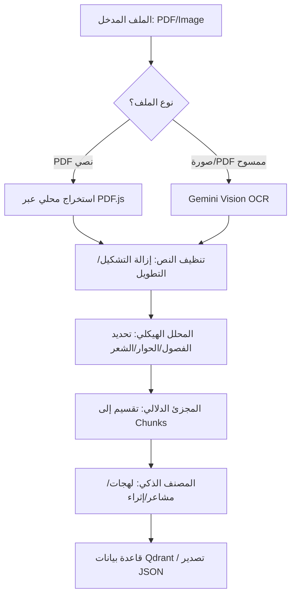

# 📜 مشروع "النص": نظام متكامل لاستخراج وتحليل النصوص العربية (Al-Nass Extractor)

**الإصدار:** 1.0.0
**الدور:** توثيق معماري وتقني للمطورين

---

## 1. نظرة عامة على المشروع (Project Overview)

### ملخص رفيع المستوى
يعد مشروع **Al-Nass Extractor** منصة متطورة مبنية بلغة **TypeScript** وإطار عمل **React**، مصممة خصيصاً لمعالجة النصوص العربية الأدبية والمعقدة. يقوم النظام بتحويل البيانات غير المهيكلة (مثل الصور وملفات PDF) إلى بيانات مهيكلة غنية دلالياً وجاهزة للاستخدام في تطبيقات الذكاء الاصطناعي المتقدمة مثل أنظمة توليد النصوص المعزز بالاسترجاع (RAG) أو تدريب النماذج اللغوية.

### القدرات الجوهرية
*   **استخراج النصوص (OCR):** محرك هجين يعتمد على **Google Gemini** للرؤية الحاسوبية مع معالجة محلية لملفات PDF النصية.
*   **التحليل الهيكلي (Structural Parsing):** خوارزمية ذكية للتمييز بين السرد، الحوار، الشعر، والنصوص القرآنية.
*   **التجزئة الدلالية (Semantic Chunking):** تقسيم النصوص تكرارياً بناءً على عدد الرموز (Tokens) مع الحفاظ على سياق اللغة العربية.
*   **الإثراء والتصنيف (AI Enrichment):** تصنيف اللهجات، تحليل المشاعر، وتوليد أزواج (سؤال/جواب) آلياً.
*   **الفهرسة المتجهة (Vector Indexing):** تكامل مباشر مع **Qdrant** لتخزين واسترجاع المتجهات الدلالية.

### الحزمة التقنية (Tech Stack)
*   **اللغة الأساسية:** TypeScript (Strict Mode).
*   **إطار العمل:** React 19 + Vite.
*   **محركات الذكاء الاصطناعي:** Google GenAI (Gemini), Anthropic SDK (Claude), HuggingFace Inference.
*   **المعالجة المحلية:** `pdfjs-dist` لاستخراج نصوص PDF، و `js-tiktoken` لحساب التوكنز.
*   **قواعد البيانات:** Qdrant (Vector Database).

---

## 2. الهندسة المعمارية والتصميم (Architecture & Design)

### تحليل الهيكل الموحد
يعتمد النظام على بنية **خط الإنتاج المتسلسل (Pipeline Architecture)**، حيث تمر البيانات بخمس مراحل أساسية. يتم إدارة الحالة (State) بشكل مركزي في المكون `App.tsx` لضمان تدفق البيانات بسلاسة بين المكونات.

### المخطط الانسيابي للمنطق (Logic Flow)



### أنماط التصميم المستخدمة (Design Patterns)
1.  **Singleton Pattern:** مستخدم في `TokenizerService` و `ConfigManager` لضمان وجود نسخة واحدة فقط من محرك حساب التوكنز والإعدادات.
2.  **Facade Pattern:** المتمثل في `ChunkingProcessor` الذي يخفي تعقيدات التجزئة خلف واجهة بسيطة.
3.  **Strategy Pattern:** في `IndexingService` للتبديل بين مزودي خدمة Embedding (OpenAI vs HuggingFace).

---

## 3. التثبيت والإعداد (Installation & Setup)

### المتطلبات المسبقة
*   Node.js (الإصدار 22 أو أحدث).
*   مفتاح API لـ Google Gemini.
*   (اختياري) مفاتيح API لـ HuggingFace و Anthropic للميزات المتقدمة.

### خطوات التثبيت
1.  تحميل التبعيات:
    ```bash
    npm install
    ```
2.  إعداد متغيرات البيئة: قم بإنشاء ملف `.env` في المجلد الرئيسي:
    ```env
    VITE_GEMINI_API_KEY=your_gemini_key
    # للميزات المتقدمة
    VITE_HF_API_KEY=your_huggingface_key
    VITE_ANTHROPIC_API_KEY=your_anthropic_key
    ```
3.  تشغيل بيئة التطوير:
    ```bash
    npm run dev
    ```

---

## 4. دليل الاستخدام (Usage Guide)

### المرحلة الأولى: الاستخراج
قم برفع الملفات في "منطقة الرفع". يمكنك ضبط إعدادات التنظيف مثل "إزالة التشكيل" أو تفعيل وضع `Agentic Plus` للوثائق ذات التخطيطات المعقدة (أعمدة، جداول).

### المرحلة الثانية: التحليل الهيكلي
بعد الاستخراج، انتقل لتبويب "التحليل". سيقوم النظام تلقائياً بتقسيم النص إلى فصول. يمكنك مراجعة الإحصائيات مثل "نسبة الحوار" مقابل "السرد".

### المرحلة الثالثة: التقطيع والفهرسة
قم بتحديد `Chunk Size` (حجم المقطع)، ثم اضغط "بدء التقطيع". النتائج ستكون جاهزة للإرسال إلى Qdrant عبر تبويب "الفهرسة" للبحث الدلالي لاحقاً.

---

## 5. هيكلية الكود ومرجع الواجهة البرمجية (API Reference)

### الخدمات الأساسية (Core Services)

#### 1. `ParsingService`
**الغرض:** تحليل بنية الرواية وتقسيمها دلالياً.
*   **Signature:** `static async parseNovel(source: string | Blob, fileName: string, config: ParserConfig): Promise<NovelStructure>`
*   **المنطق الداخلي:** يستخدم `Async Generators` لمعالجة النصوص الضخمة سطراً بسطر لتوفير استهلاك الذاكرة.

#### 2. `RecursiveArabicSplitter`
**الغرض:** تقسيم النص العربي تكرارياً بناءً على الرموز.
| البارامتر | النوع | الوصف |
| :--- | :--- | :--- |
| `text` | `string` | النص المراد تقطيعه. |
| `limit` | `number` | الحد الأقصى للتوكنز في المقطع الواحد. |

#### 3. `IndexerPipeline`
**الغرض:** إدارة عملية التضمين (Embedding) والرفع إلى Qdrant.
*   **Handling Edge Cases:** يتضمن محرك إعادة المحاولة `RetryHandler` مع خاصية `Exponential Backoff` للتعامل مع أخطاء الشبكة أو حدود الاستخدام (Rate Limits).

### تعريفات الأنواع الهامة (Types)
```typescript
export interface NovelStructure {
  novel_metadata: NovelMetadata; // العنوان، المؤلف، تاريخ المعالجة
  chapters: Chapter[];           // قائمة الفصول والمقاطع
  statistics: NovelStatistics;   // نسب السرد، الحوار، عدد أبيات الشعر
}

export interface EnrichedChunk {
  chunk_id: number;
  text: string;
  fast_labels: FastLabels;       // اللهجة، المشاعر، جنس المتحدث
  llm_augmentation: LLMAugmentation | null; // Q&A، التعليل، استخراج الكيانات
}
```

---

## 6. الخاتمة (Conclusion)

مشروع **Al-Nass Extractor** ليس مجرد أداة OCR، بل هو بيئة معالجة لغوية متكاملة (NLP Suite) مخصصة للغة العربية. بفضل بنية الخدمات المستقلة (Modular Services) وتكاملها مع تقنيات Vector DB، يوفر المشروع أساساً صلباً لبناء تطبيقات "الدردشة مع الكتب العربية" أو أنظمة الأرشفة الذكية.

**الخطوات التالية للمطورين:**
*   توسيع قواعد `RuleBasedClassifier` لتشمل تصنيفات أدبية أكثر دقة.
*   تطوير واجهة مستخدم لاسترجاع البيانات والبحث الدلالي (RAG UI).
*   نقل عمليات الـ API الحساسة إلى وسيط برمجيات (Backend Proxy) لتعزيز الأمان.